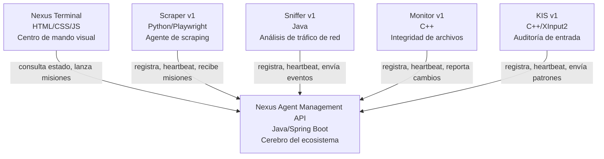

```markdown
# Ecosistema Nexus

El ecosistema Nexus es un sistema modular de monitoreo y orquestación de agentes de software. Cada componente se comunica a través de una API REST central, permitiendo registro, asignación de misiones, reporte de eventos y supervisión en tiempo real.

## Arquitectura



## Componentes

| Proyecto | Lenguaje | Descripción |
|----------|----------|-------------|
| [Nexus Terminal](https://github.com/Alonex-x/nexus-terminal) | HTML/CSS/JS | Panel de control visual con estética CRT |
| [Nexus Agent Management API](https://github.com/Alonex-x/nexus-agent-api) | Java/Spring Boot | API REST central del ecosistema |
| [Nexus Scraper](https://github.com/Alonex-x/nexus-scraper) | Python/Playwright | Agente de web scraping sigiloso |
| [Desktop Automation Toolkit](https://github.com/Alonex-x/desktop-automation-toolkit) | Python | Automatización de tareas de escritorio |
| [Network Traffic Analyzer](https://github.com/Alonex-x/network-traffic-analyzer) | Java | Análisis de tráfico de red |
| [File Integrity Monitor](https://github.com/Alonex-x/file-integrity-monitor) | C++ | Monitor de integridad de archivos |

## Flujo de trabajo

1. Los agentes se registran en la API y obtienen una API Key.
2. Cada agente envía heartbeats periódicos para mantenerse ONLINE.
3. El Nexus Terminal consulta el estado de los agentes y muestra el panel en tiempo real.
4. Las misiones se crean en la API y son recogidas por los agentes correspondientes.
5. Los agentes reportan resultados y eventos a través de la API.
```

